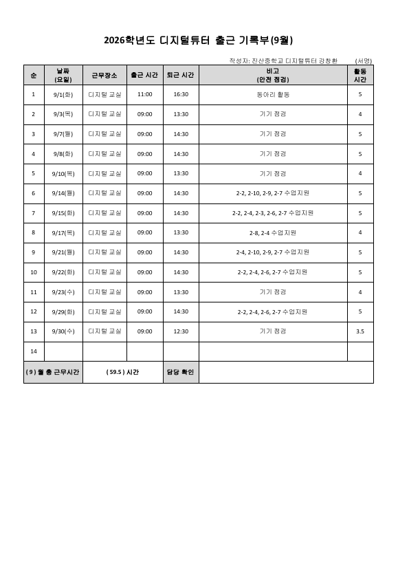
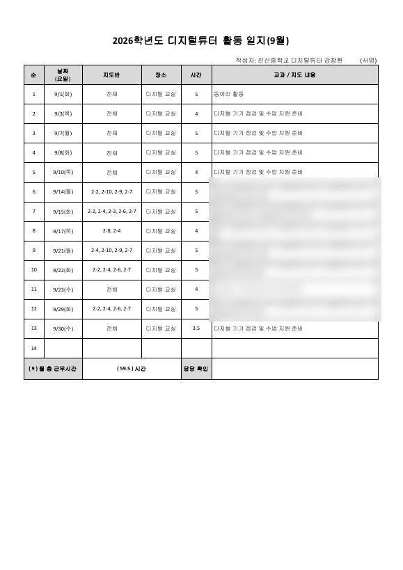
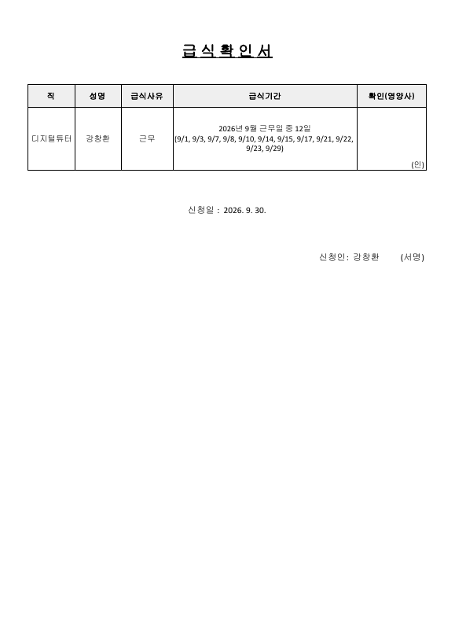
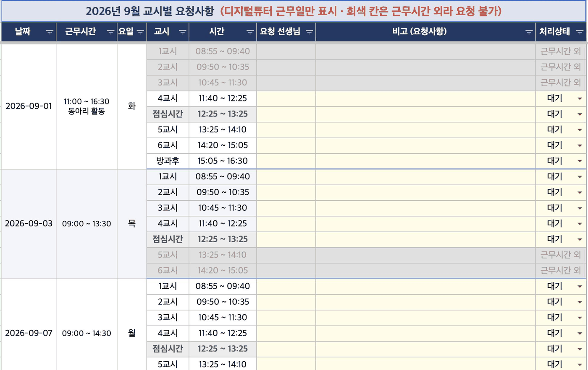
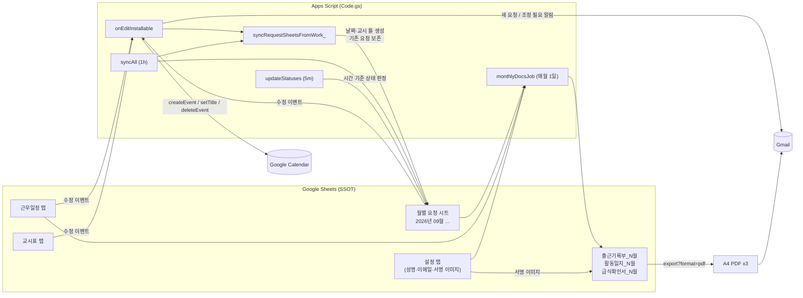

# 디지털튜터 업무 자동화 (Google Sheets + Apps Script)

> 학교 디지털튜터의 반복 행정 업무(요청 관리 → 캘린더 → 상태 추적 → 월별 제출 서류)를
> **Google Sheets 한 장을 단일 진실 원천(SSOT)으로 두고 전부 자동 파생**시킨 프로젝트입니다.
> 서버 없음, 비용 0원, 인수인계는 "시트 사본 1개".
>
> 요구사항 정리부터 구현·검증까지 AI 코딩 에이전트(Claude 기반 Aside)와 협업했고, 요구사항이 바뀐 과정과 실수까지 [docs/ai-workflow.md](docs/ai-workflow.md)에 기록했습니다.

  
  
  

자동 생성된 출근기록부 / 활동일지 / 급식확인서 (A4 PDF, 개인정보 마스킹)

  

근무일정에서 자동 생성되는 월별 요청표. 근무일만 표시되고, 근무시간 밖 교시는 회색(입력 차단), 늦게까지 근무하는 날은 "방과후" 칸이 생김

## 문제 (Before)

| 업무 | 기존 방식 | 문제 |
|---|---|---|
| 수업 지원 요청 접수 | 선생님들이 공유 시트의 교시 칸에 요청을 적음 | 튜터가 수시로 시트를 열어 눈으로 확인. 누락 잦음 |
| 요청표와 근무표 | 요청표는 "월·화·목" 고정 패턴으로 미리 만들어 둠 | 실제 근무일정(대체근무, 시간 조정)과 어긋나 **근무하지 않는 날에 요청이 들어오는 착오** 발생 |
| 일정 관리 | 확인한 요청을 수기로 캘린더에 옮김 | 이중 입력, 수정/취소 반영 안 됨 |
| 처리 상태 | 드롭다운을 손으로 바꿈 | 늘 "대기"로 남아 있어 의미 없음 |
| 월말 제출 서류 | 출근기록부·활동일지·급식확인서를 매달 수기 작성 + 서명 | 근무일정표와 요청 시트를 대조하며 2~3시간 소요, 오기 발생 |

## 해결 (After)

| 트리거 | 동작 |
|---|---|
| 요청 시트 수정 즉시 (`onEdit`) | 요청 행 → Google 캘린더 일정 생성/수정/삭제, 이메일 알림 |
| **근무일정 수정 즉시** (`onEdit`) | 월별 요청표의 날짜·교시 틀을 근무일정 기준으로 다시 생성. 기존 요청은 (날짜, 교시)로 옮겨 담고, 갈 곳이 없어진 요청은 표 아래 "조정 필요" 구역으로 격리 + 메일 |
| 5분마다 | 처리상태 자동 갱신: `확인중 → 대기 → 진행중 → 완료` (시간 기준), `보류`는 수동 보호 |
| 1시간마다 | 요청표 틀 점검 + 전체 재동기화 (안전장치, 6분 실행 제한 대응 포함) |
| 매월 1일 08:00 | 전월 **출근기록부 / 활동일지 / 급식확인서** 생성, **설정 탭의 서명 이미지 자동 날인** → A4 PDF 3장 이메일 발송 |

- 요청 누락 0건, 캘린더 반영 지연 수초
- 요청표 ↔ 근무표 불일치 0: 요청표가 근무일정에서 파생되므로 어긋날 수 없음
- 월별 서류 작성 시간 2~3시간 → 0 (서명까지 자동, 인쇄만)
- 설정·서명은 코드가 아닌 `설정` 탭에서 변경 → 후임자 인수인계는 시트 사본 + 메뉴 클릭 1회

## 아키텍처

자세한 데이터 흐름과 설계 결정은 [docs/architecture.md](docs/architecture.md) 참고.

## 핵심 설계 결정

| 결정 | 이유 |
|---|---|
| **Apps Script 선택** (외부 서버 X) | 학교 계정 안에서 끝남. 서버·비용·보안 승인 불필요. 인수인계 = 시트 사본 |
| **이벤트ID를 숨김 열(I)에 저장** | 행 ↔ 캘린더 일정 1:1 매핑으로 멱등성 확보. 수정하면 업데이트, 지우면 삭제, 중복 생성 없음 |
| **요청표 틀을 근무일정에서 파생** | 사람이 두 표를 맞추는 구조 자체가 착오의 원인. 근무일정을 유일한 원천으로 두고 요청표의 날짜·교시는 코드가 생성 |
| **틀이 달라졌을 때만 다시 그림** | 현재 시트의 행별 "틀 서명"(날짜/근무시간/교시/시간/회색 여부)과 계산 결과를 비교. 같으면 아무것도 안 함 → 매시간 점검해도 부담 없음 |
| **요청은 절대 지우지 않음** | 근무일이 바뀌어 칸이 사라진 요청은 표 아래 "근무일정과 맞지 않는 요청" 구역으로 옮기고 `확인중` + 캘린더 제목 `[근무일정 확인]`. 근무일정을 되돌리면 원래 칸으로 자동 복귀 |
| **날짜는 `yyyy-MM-dd` 문자열로 기록** | 시트 시간대와 스크립트 시간대가 다르면 스크립트가 만든 자정 Date가 시트에서 전날로 보임. 문자열로 쓰면 시트가 자기 시간대로 해석 |
| **상태를 "등록 여부"가 아닌 "시간 기준"으로 판정** | 필요한 건 "지금 뭘 해야 하나". `대기/진행중/완료`를 시각으로 계산하고 `보류`만 수동 보호 |
| **서명은 설정 탭의 셀 이미지 → 서류에 겹쳐 찍기** | 사람이 바뀌면 이미지만 교체. 업로드 대화상자 대신 시트 기본 기능(셀에 이미지 삽입)을 써서 추가 권한 승인 불필요 |
| **6분 실행 제한 대응** | 4.5분 시간 예산 + 초과 시 1분 뒤 이어서 실행하는 일회성 트리거 |
| **서류용 `활동` 열을 근무일정 `비고`와 분리** | "주 14시간 준수 조정" 같은 행정 메모가 서류에 섞이는 문제 → 데이터 모델 수정 |
| **PDF는 Sheets export URL + OAuth 토큰** | 별도 PDF 라이브러리 없이 `fitw=true&size=A4`로 양식 그대로 1장 출력 |

## 처리상태 규칙

| 상태 | 조건 | 판정 |
|---|---|---|
| 확인중 | 요청은 있으나 캘린더 등록 전/실패, 또는 **근무일정상 근무일·근무시간이 아님** | 자동 |
| 대기 | 등록됨, 시작 전 | 자동 |
| 진행중 | 현재 시각이 해당 교시 안 | 자동 (5분) |
| 완료 | 교시 종료 | 자동 (5분) |
| 보류 | 직접 선택 | 수동, 절대 덮어쓰지 않음 |

## 설치 (사본으로 받는 경우)

1. 시트 사본 만들기 (`파일 > 사본 만들기`). 스크립트가 함께 복사됩니다.
2. 메뉴 **디지털튜터 캘린더 > 처음 설치 안내** 클릭 → `설정` 탭에서 성명/이메일/학교명 수정 - [template/설정_sample.csv](template/설정_sample.csv)
3. `근무일정` 탭에 근무일정 입력 (열: 날짜 / 요일 / 출근 / 퇴근 / 실근무시간 / 비고 / 활동) - [template/근무일정_sample.csv](template/근무일정_sample.csv)
   - 월별 요청 시트는 여기서 자동으로 만들어집니다. 날짜를 직접 넣지 않습니다.
   - 교시 시간이 다르면 `교시표` 탭 수정 (없으면 자동 생성) - [template/교시표_sample.csv](template/교시표_sample.csv)
4. 메뉴 **트리거 설치 (최초 1회)** → Google 권한 승인 ("확인하지 않은 앱" 경고는 고급 > 이동)
5. (선택) `설정` 탭 `SIGNATURE` 행의 값 칸 선택 → **삽입 > 이미지 > 셀에 이미지 삽입**으로 서명 이미지 등록. 메뉴 **서명 이미지 확인**으로 점검. 비워 두면 서류에 (서명) 칸만 남습니다.

코드만 가져가는 경우: `Code.gs` + `appsscript.json`을 시트에 바인딩된 Apps Script 프로젝트에 붙여넣고 3~5번 진행. [clasp](https://github.com/google/clasp) 사용 시 `clasp push`.

## 시트 구조

### 월별 요청 시트 (자동 생성)

| A 날짜 | B 근무시간 | C 요일 | D 교시 | E 시간 | F 요청 선생님 | G 비고(요청사항) | H 처리상태 | I 이벤트ID(자동, 숨김) |
|---|---|---|---|---|---|---|---|---|
| 2026-09-14 (병합) | 09:00 ~ 14:30 (병합) | 월 | 1교시 | 08:55 ~ 09:40 | 김○○ | 2학년 2반 수업 지원 | 대기 | (자동) |
| | | | 6교시 | 14:20 ~ 15:05 | (회색, 입력 불가) | | 근무시간 외 | |

- 근무일정에 있는 날만 날짜 블록이 생김. 교시는 `교시표` 탭 기준
- 교시가 근무시간(± `PERIOD_TOLERANCE_MIN`분) 밖이면 회색 + 입력 차단. 마지막 교시 뒤로 30분 이상 근무하면 `방과후` 칸 추가
- A~E열은 자동 생성 영역이라 고치려 하면 경고가 뜸
- 근무일정 변경으로 칸이 없어진 요청은 표 맨 아래 "근무일정과 맞지 않는 요청" 구역에 모임
- G열에 `N학년 M반`을 쓰면 서류의 지도반(`2-2`)이 자동 추출됨
- 2행이 헤더이고 A2가 `날짜`인 시트만 요청 시트로 인식 (다른 탭에는 영향 없음)

### 설정 탭 주요 항목

| 키 | 예 | 설명 |
|---|---|---|
| `TUTOR_NAME`, `SCHOOL_NAME`, `OWNER_EMAIL` ... | 홍길동 / ○○중학교 | 서류 작성자, 알림 받을 메일 등 |
| `PERIOD_TOLERANCE_MIN` | 10 | 교시가 근무시간을 이 분만큼 벗어나도 요청 가능 (예: 1교시 08:55 / 출근 09:00) |
| `SIGNATURE` | (셀 이미지) | 서류의 (서명) 자리에 찍힐 서명. 투명 배경 PNG 권장. 이미지 주소나 공개 Drive 링크도 가능 |

## 기술 스택

Google Apps Script (V8) · SpreadsheetApp (CellImage, OverGridImage, Protection, DataValidation) · CalendarApp · MailApp · UrlFetchApp · LockService · PropertiesService · 시간/이벤트 트리거

## 개발 과정 (AI 협업)

Claude 기반 브라우저 에이전트(Aside)와 함께 요구사항 → 설계 → 구현 → 브라우저 검증을 반복했습니다. 사람이 한 일과 AI가 한 일, 중간에 바뀐 요구사항, 실패했던 시도는 [docs/ai-workflow.md](docs/ai-workflow.md)에 정리했습니다.

## 라이선스

MIT
